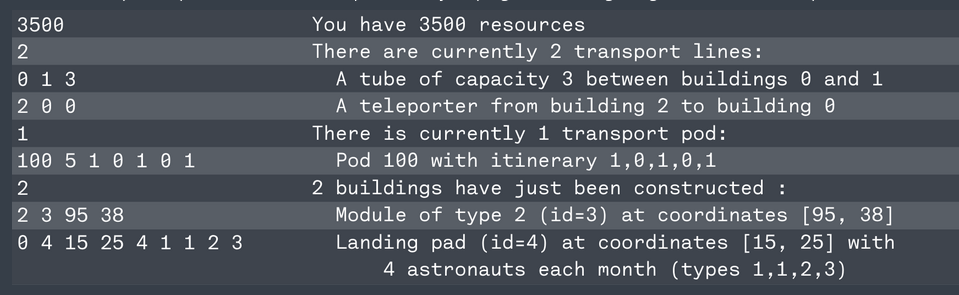

# Each month (rounds):
- 20 rounds in total
- New `resources` available
- New `building` to add to the `network`

# Transport Infrastructure: (Edges)
- `Lunar-tubes`:
- `Teleporters`:

# Buildings: (Vertices)
Note: The map is a rectangle of 160x90 km

- `Lunar-modules`:
    . Have `types`: e.i [laboratory, ground-sampling-site, observatory ...]

- `Landing-pads`:
    . Entry point for `Astronauts`, new waves each month.

`Astronauts` need to be housed in coresponding `lunar-modules`

## Scoring
-Up to 100 `points` per `astronauts` per `month`
    . 50 for speed, -1 per day astronauts are not in the correct `lunar-module`
    . 50 for `Population-balance` (Whatever that means)

## Gameplay
# Phase-1: Input

On the first line, an integer `resources` representing the total amount of resources you currently have.
On the next line, an integer `numTravelRoutes`, the number of routes (`tubes` or `teleporters`) currently present in the city.
On the next `numTravelRoutes lines`, the `description` of a tube or teleporter as a list of three space-separated integers `buildingId1`, `buildingId2` and `capacity`:
    buildingId1 and buildingId2 are the ends of the tube or teleporter.
    capacity equals 0 if the route is a teleporter, and represents the `capacity of the tube` otherwise.
On the next line, an integer `numPods`, the number of `transport pods` currently present in the `network` of magnetic tubes.
On the next `numPods lines`, the description of a pod as a list of space-separated integers:
    The first integer is the unique identifier of the `pod-id`.
    The second integer is the number `numStops` of stops in the `pod-path`.
    The next `numStops` integers represent the `pod's path-ids`, i.e. the identifiers of each building on its itinerary.
On the next line, an integer `numNewBuildings`, the number of buildings that have just been `constructed`.
On the next `numNewBuildings lines`, the description of a new building, as a list of space-separated integers. The format of each line depends on the building type:
    If the building is a `landing pad`: 0 `buildingId` `coordX` `coordY` `numAstronauts` `astronautType1` `astronautType2` ...
    Otherwise, the first `number` is positive and the building is a `lunar module`: `moduleType` `buildingId` `coordX` `coordY`

# Phase-2: Construction
- `Tube` (Building-id-A, Building-id-B), cost scales with length, initial capacity of 1 `pod`
- `Upgrade` (Building-id-A, Building-id-B), upgrade cost: initial-cost * (current-pod-capacity + 1), increase capacity by 1 `pod`

- `Teleporter` (building-id-entrance, buildind-id-exit)

- `pod`--> On a tube `destroy-pod`--> Refund 75%
- `Wait` do nothing

# Phase-3: Astronauts movements
Traversing a magnetic tube always takes one day, regardless of the distance. On a given network, we can then define the distance from one building to another as the minimal number of tubes needed to make the entire trip (teleporters can be used in said trip).

Astronauts plan their route in a naive way, by trying to move towards their nearest target module (or any nearest module if several exist). They will take any tube or teleporter available that takes them closer to their destination, without actually considering the pods scheduled on the following days to determine whether their trajectory is optimal or even feasible.

The movement phase happens in 4 steps each day:

    Teleporters: each astronaut standing on a teleporter entrance will take it, if the exit building has a distance to the target less than or equal to the entrance building. Since teleportation is instantaneous, the astronaut can then take a magnetic tube in the same day.
    Allocation of pods in magnetic tubes: it is possible that several pods are trying to move through a tube that has insufficient capacity to accommodate them all. In this case, pods with the smallest identifier are given priority, and the others remain in place until the next day.
    Allocation of astronauts in pods: each astronaut tries to find a pod with a free seat that will move towards their destination (i.e. a strictly lower distance), and hops on board. Astronauts choose in order, the astronauts who come from a landing pad with lower identifier pick first. If several options can bring an astronaut closer to their target, the pod with the smallest identifier will be chosen.
    Launch of all pods: each pod moves towards its next step with its astronauts on board, then all passengers disembark.
